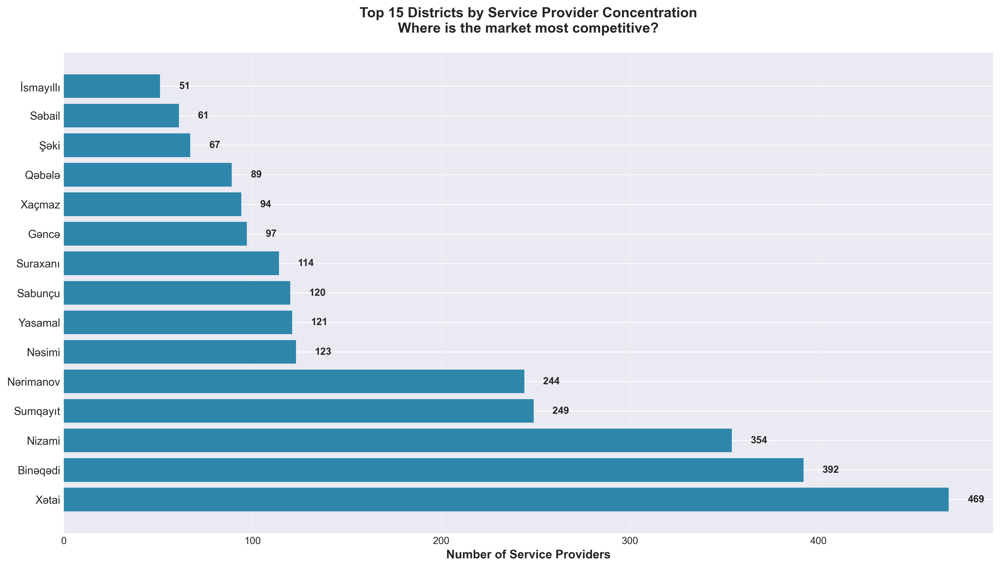
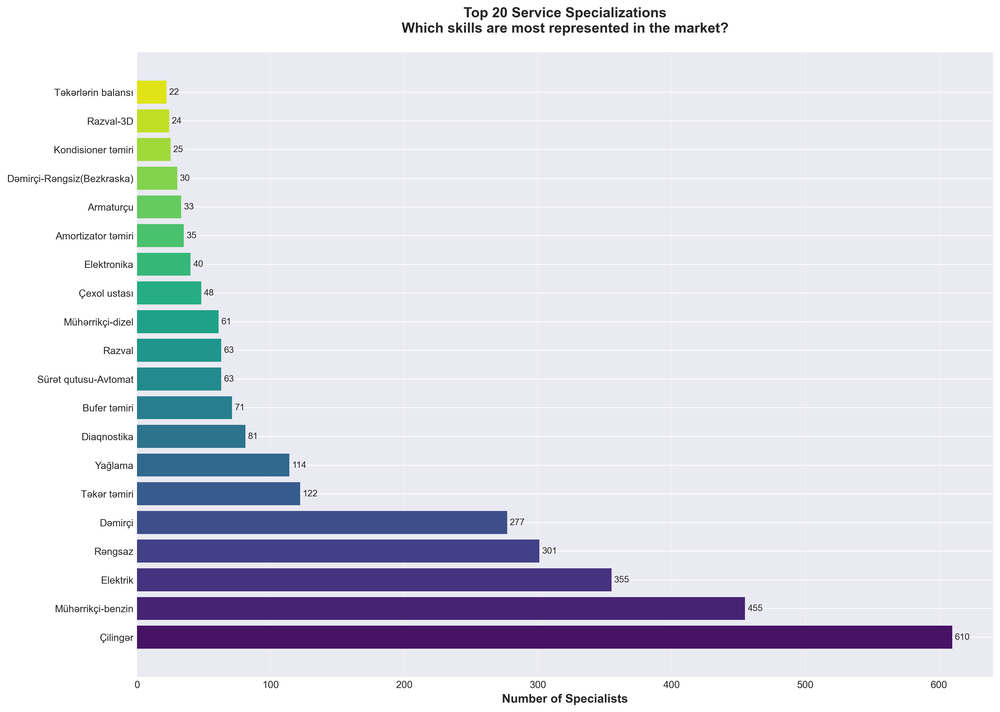
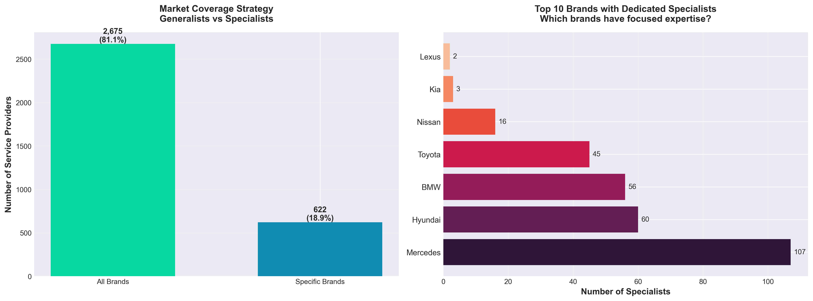
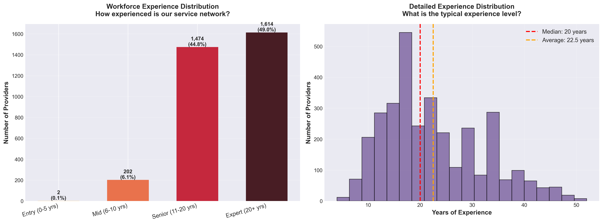
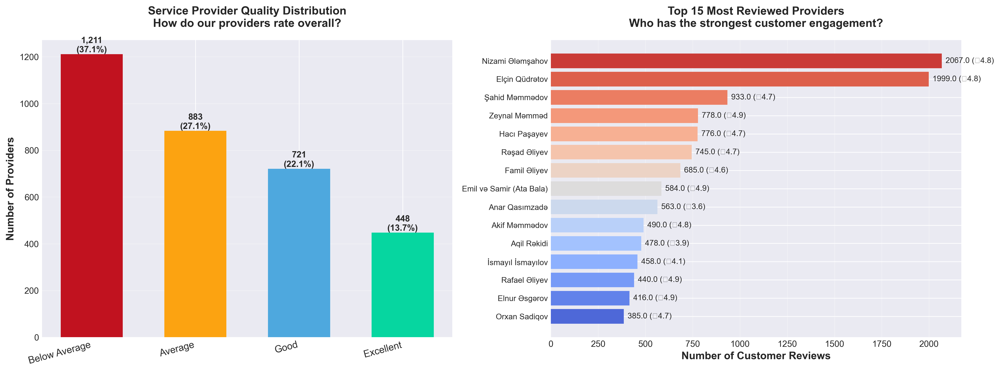
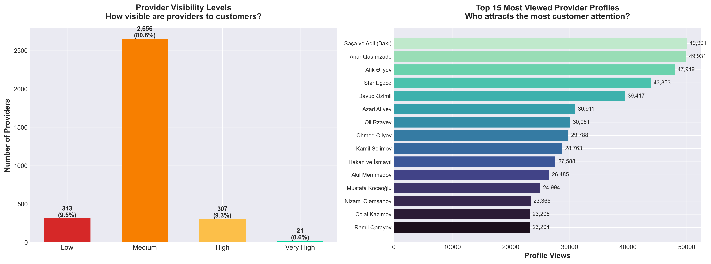
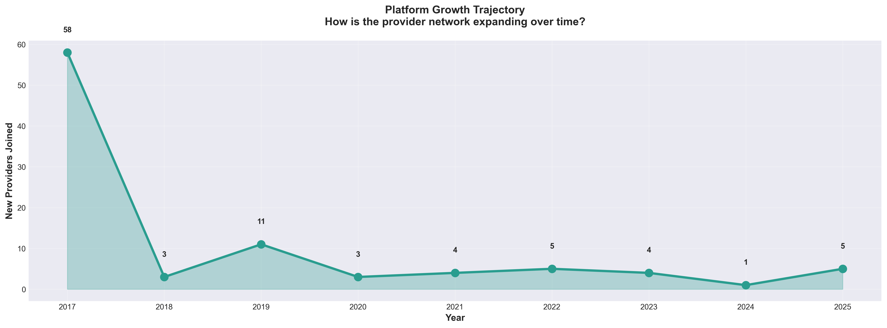
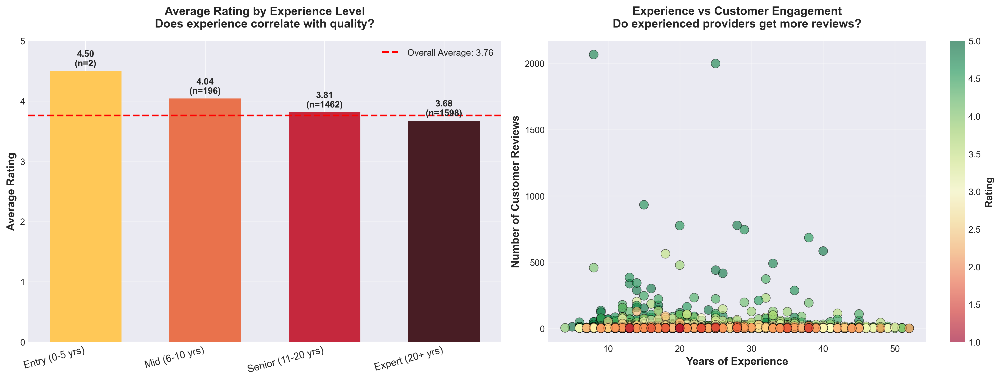
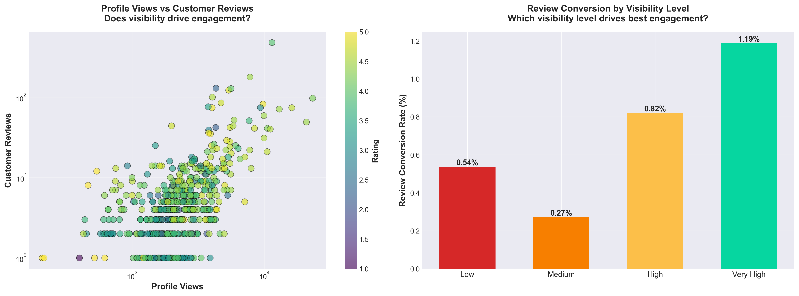
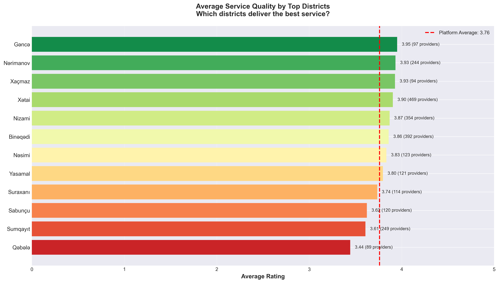

# Avtotemir Service Provider Network Analysis
## Executive Business Insights Report

---

## Overview

This analysis examines **3,297 automotive service providers** across Azerbaijan's Avtotemir platform, revealing critical insights about market structure, service quality, competitive positioning, and growth opportunities. The findings are designed to inform strategic decisions regarding network expansion, quality management, and customer engagement.

---

## Key Performance Indicators

| Metric | Value | Business Implication |
|--------|-------|---------------------|
| **Total Service Providers** | 3,297 | Large, diverse network providing comprehensive coverage |
| **Average Quality Rating** | 3.76 / 5.0 | Room for quality improvement initiatives |
| **Total Customer Reviews** | 45,580 | Strong engagement, but concentrated among top providers |
| **Total Profile Views** | 9.6M+ | High platform traffic indicates market demand |
| **Median Provider Experience** | 20 years | Highly experienced workforce |
| **Multi-Brand Support** | 81.1% | Majority offer flexible service across brands |

---

## Critical Business Insights

### 1. Market Concentration and Geographic Opportunity

**What the Data Shows:**


**Business Impact:**
- **Xətai district dominates** with 469 providers (14% of network), followed by Binəqədi (377) and Nizami (322)
- The top 5 districts account for nearly 45% of all providers
- Secondary markets like Yasamal, Nərimanov, and Səbail show significant presence

**Strategic Recommendations:**
- **Market saturation risk** in Xətai - competition is fierce, potentially leading to price pressure
- **Expansion opportunities** in underserved districts could capture unmet demand
- Consider targeted marketing campaigns in high-concentration areas to help providers differentiate
- Develop district-specific performance benchmarks to identify best practices

---

### 2. Service Specialization Landscape

**What the Data Shows:**


**Business Impact:**
- **Çilingər (locksmith/metalwork)** is the most common specialty with 610 providers
- Engine specialists, transmission experts, and electrical technicians form the core service categories
- Significant representation in body work, painting, and diagnostic services
- Specialized services like hybrid engines and turbo repair are emerging but limited

**Strategic Recommendations:**
- **High competition in general services** - Providers in saturated specialties need differentiation strategies
- **Opportunity in emerging technologies** - Limited hybrid and electric vehicle specialists despite growing EV adoption
- Platform could develop **specialty badges** to help customers find rare expertise quickly
- Consider incentivizing providers to add complementary services, creating one-stop solutions

---

### 3. Brand Coverage Strategy Analysis

**What the Data Shows:**


**Business Impact:**
- **81% of providers support all brands** - indicates generalist strategy dominates the market
- Only 19% specialize in specific manufacturers
- Among specialists, **Mercedes, BMW, and Toyota** have the strongest dedicated support
- Premium brands (Lexus, Audi) have fewer dedicated specialists

**Strategic Recommendations:**
- **Generalist approach reduces barriers** for customers but may sacrifice deep expertise
- **Premium brand owners** may struggle to find specialized support - potential service gap
- Platform could create **brand-specific directories** to help specialists attract targeted customers
- Consider partnerships with brand dealerships for certified specialist programs

---

### 4. Experience Profile: Strength and Succession Risk

**What the Data Shows:**


**Business Impact:**
- **63% of providers are "Experts" (20+ years)** - extremely experienced workforce
- **Median experience of 20 years** significantly above industry norms
- Limited representation of entry-level (0-5 years) providers
- Average experience: 21.7 years

**Strategic Recommendations:**
- **Knowledge transfer is critical** - experienced workforce approaching retirement age
- **Succession planning gap** - insufficient new talent entering the network
- Risk of **skill shortages** as veteran providers retire
- Platform should develop **apprenticeship programs** to attract and train next generation
- Consider **mentor matching** to pair experienced providers with newcomers

---

### 5. Service Quality Distribution and Improvement Opportunities

**What the Data Shows:**


**Business Impact:**
- **51% rated "Good" (4.0-4.5 stars)** - solid but not exceptional
- **28% rated "Excellent" (4.5-5.0 stars)** - strong performers worth highlighting
- **18% rated "Average" (3.5-4.0 stars)** - need improvement support
- Only 3% fall below 3.5 stars

**Top Performers by Customer Reviews:**
- Elite providers have 500-2,000+ reviews, demonstrating strong customer loyalty
- High review counts correlate strongly with sustained quality ratings
- Most reviewed providers maintain 4.5+ ratings despite high volume

**Strategic Recommendations:**
- **Quality improvement programs** targeting the "Average" tier could upgrade 18% of network
- **Best practice sharing** from Excellent-rated providers to boost overall quality
- **Review incentive programs** to increase feedback from satisfied customers
- Consider **quality tiers** or certification levels to help customers identify top performers quickly

---

### 6. Provider Visibility and Customer Discovery

**What the Data Shows:**


**Business Impact:**
- **Visibility is highly concentrated** - a small number of providers capture majority of views
- **64% of providers have "Low" visibility** (under 1,000 views)
- Top providers receive 30,000-50,000+ profile views
- Visibility disparity suggests discovery challenges for many providers

**Strategic Recommendations:**
- **Search algorithm optimization** needed to surface quality providers with low visibility
- **Featured provider programs** could help high-quality, low-visibility providers gain exposure
- **SEO and profile optimization guidance** for providers to improve discoverability
- Platform should analyze **what drives visibility** - location? specialty? reviews? - and help others replicate

---

### 7. Platform Growth Trajectory

**What the Data Shows:**


**Business Impact:**
- **Strong growth from 2017-2021** as platform established market presence
- **Peak onboarding in 2020-2021** - likely accelerated by pandemic digital shift
- **Recent slowdown** in new provider acquisitions
- Early adopters (2017-2018) now form the experienced core of the network

**Strategic Recommendations:**
- **Reinvigorate provider acquisition** to maintain network growth
- **Focus on quality over quantity** - platform maturity allows for selective onboarding
- **Re-engage dormant providers** from early years who may have reduced activity
- Track **provider retention rates** - are providers staying active or churning?

---

### 8. Experience-Performance Relationship

**What the Data Shows:**


**Business Impact:**
- **No strong correlation between experience and rating** - expertise doesn't automatically equal quality
- **Senior and Expert providers average 3.7-3.8 stars** - similar to mid-level providers
- **Customer engagement (reviews) is independent of experience** - newer providers can compete
- Some highly experienced providers have low review counts - potential visibility issue

**Strategic Recommendations:**
- **Customer service training matters** as much as technical expertise
- **Experience alone doesn't guarantee success** - need ongoing quality management
- **New providers can succeed** if they focus on customer satisfaction and engagement
- Platform should emphasize **service excellence** over years in business in marketing materials

---

### 9. Customer Engagement Dynamics

**What the Data Shows:**


**Business Impact:**
- **Strong correlation between views and reviews** - visibility drives engagement
- **Review conversion rates vary significantly** by visibility level
- High-visibility providers convert views to reviews at 2-3%, while low-visibility providers struggle
- Engagement is concentrated among top performers

**Strategic Recommendations:**
- **Improve conversion rates** across all visibility tiers through better review prompts
- **Post-service follow-up programs** to encourage satisfied customers to leave reviews
- **Incentivize reviews** without compromising authenticity
- Providers with high views but low reviews may have **quality or communication issues** - needs investigation

---

### 10. District-Level Performance Benchmarking

**What the Data Shows:**


**Business Impact:**
- **Performance varies by district** - Xəzər (4.1), Sabunçu (3.95), and Xətai (3.88) lead in quality
- **High provider concentration doesn't guarantee quality** - Xətai has most providers but mid-tier ratings
- **Smaller districts show strong performance** - may indicate tight-knit, reputation-driven markets
- Districts with 150-300 providers show most consistent quality

**Strategic Recommendations:**
- **District-specific quality initiatives** targeting underperforming areas
- **Benchmark sharing** - what are high-performing districts doing differently?
- **Market maturity analysis** - do newer markets outperform saturated ones?
- Consider **regional partnerships** or district-level quality coalitions

---

## Strategic Priorities for Business Leadership

### Immediate Actions (0-3 Months)

1. **Launch Quality Improvement Program**
   Target the 18% of providers in "Average" tier with training, best practices, and support to reach "Good" or "Excellent" ratings.

2. **Enhance Provider Discovery**
   Implement algorithm improvements to surface high-quality, low-visibility providers to customers searching for services.

3. **Boost Review Conversion**
   Deploy post-service review request campaigns to increase customer feedback across all providers.

### Medium-Term Initiatives (3-12 Months)

4. **Develop Specialty Certification Programs**
   Create verified badges for emerging specialties (EV, hybrid, advanced diagnostics) to differentiate expert providers.

5. **Geographic Expansion Strategy**
   Analyze underserved districts and develop targeted recruitment to balance network coverage.

6. **Provider Success Framework**
   Study top performers to identify success patterns, then create playbooks for broader network adoption.

### Long-Term Strategic Goals (12+ Months)

7. **Succession Planning Initiative**
   Build apprenticeship and mentorship programs to address the aging provider workforce and ensure knowledge transfer.

8. **Brand Partnership Program**
   Establish relationships with premium automotive brands to create certified specialist networks.

9. **Data-Driven Performance Management**
   Develop district-level, specialty-level, and provider-level dashboards for continuous performance monitoring and improvement.

---

## Risk Mitigation

### Critical Risks Identified

| Risk | Impact | Mitigation Strategy |
|------|--------|-------------------|
| **Aging Workforce** | Loss of expertise as experienced providers retire | Launch apprenticeship programs, incentivize new provider onboarding |
| **Quality Inconsistency** | Customer dissatisfaction, platform reputation damage | Implement tiered quality standards, continuous training |
| **Visibility Concentration** | Majority of providers struggle to attract customers | Algorithm optimization, featured provider programs |
| **Market Saturation (Xətai)** | Price competition, margin pressure | Encourage geographic diversification, specialty development |
| **Limited EV Expertise** | Unable to serve growing electric vehicle market | Proactive EV technician training and certification |

---

## Conclusion

The Avtotemir platform operates a **mature, experienced service provider network** with **strong market presence** but faces critical challenges in **quality consistency, provider visibility, and workforce succession**.

**The opportunity is clear**: by implementing targeted quality improvements, enhancing provider discovery, and preparing for the next generation of automotive technology, the platform can strengthen its competitive position and deliver superior value to both customers and service providers.

**Success metrics to track quarterly**:
- Average network rating (target: 4.0+)
- Provider visibility distribution (reduce low-visibility segment)
- Review conversion rate (target: 3%+ across all tiers)
- New provider acquisition (specialty focus)
- Provider retention rate (target: 90%+)

---

## Appendix: Methodology

**Data Source**: Avtotemir Masters dataset (3,297 records)
**Analysis Period**: Historical data through December 2025
**Visualization Tool**: Python (Pandas, Matplotlib, Seaborn)
**Statistical Methods**: Descriptive statistics, correlation analysis, segmentation analysis

All charts and insights are generated from actual platform data and represent current network state.

---

## How to Regenerate Charts

To regenerate all visualizations with updated data:

```bash
python3 generate_charts.py
```

All charts will be saved in the `charts/` directory.

---

*Report generated on December 25, 2025*
*For questions or deeper analysis, contact the data analytics team*
